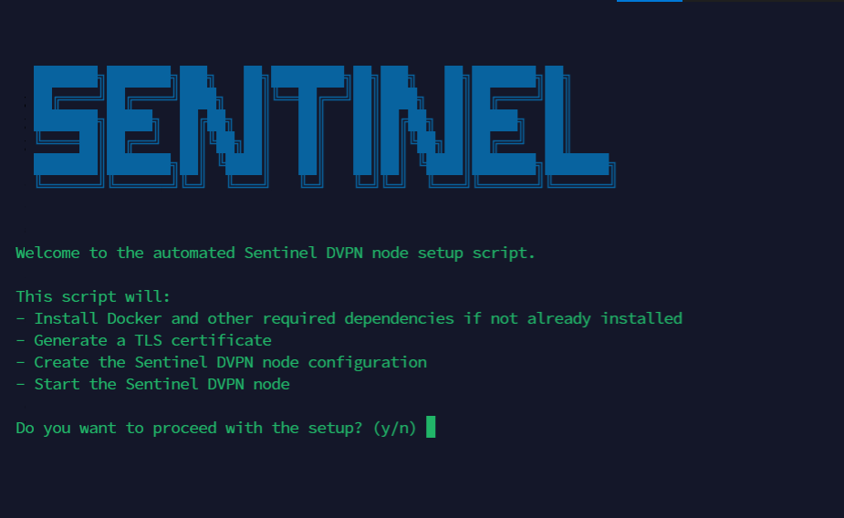

# Sentinel Raspberry PI install script
An install script to install Sentinel DVPN on a raspberry pi or any other server.

## Usage

Just copy and paste the command below into a command line on your raspberry pi/server.
```
wget -O sentinel.sh https://raw.githubusercontent.com/hibenji/sentinel_rasp_install/main/install.sh && bash sentinel.sh
```

Follow the prompts and don't forget to save your mnemonic phrase somewhere safe. (You'll need it to withdraw your earnings)
You will also need to send a small amount of DVPN to your node's wallet before you start, but that prcoess is also shown in the script.


## Example



